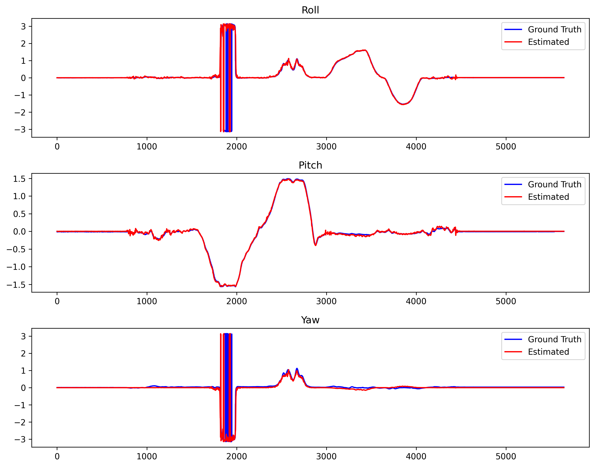
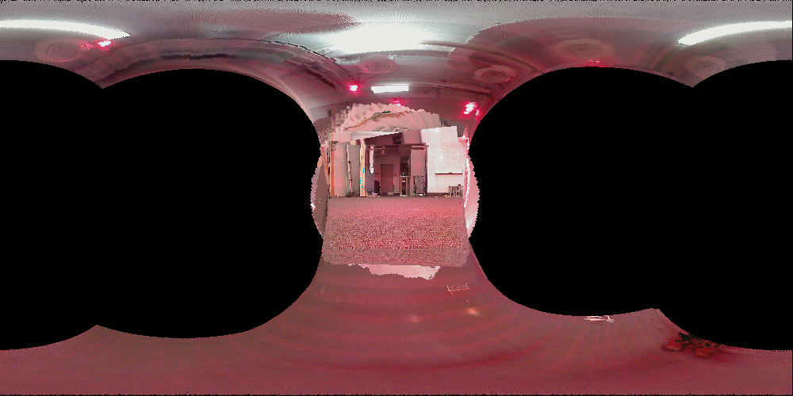

# Orientation Tracking & Panorama Stitching

`Python` `JAX` `NumPy` `Optimization` `Sensor Fusion` `Computer Vision`

Estimating 3-D orientation of a rotating body from IMU data via projected gradient descent, then
using the estimated trajectory to stitch a panorama from onboard camera images.

## Approach

- **IMU calibration**: recover accelerometer/gyro bias and scale factor from the static portion of
  each recording and the datasheet sensitivities.
- **Orientation estimation**: track orientation as a unit quaternion trajectory `q_1:T`, optimized
  with **projected gradient descent** on a cost combining a quaternion motion model (gyro
  integration) and an observation model (measured acceleration vs. gravity rotated into the body
  frame). Gradients via `jax` autodiff; projection back onto the unit-quaternion manifold after
  each step.
- **Panorama**: reproject each camera frame using its closest-in-time orientation estimate onto an
  equirectangular canvas and stitch.

## Results

Estimated roll/pitch/yaw track ground truth closely (top), and the estimated trajectory produces a
coherent panorama of the scene (bottom).

RMSE vs. ground truth: roll **5.94°**, pitch **1.25°**, yaw **6.61°**.

## Next step

This is a batch/non-causal method (uses future measurements). Planning to add a recursive EKF-based
estimator as a comparison, since that's closer to how orientation estimation is done in practice.
